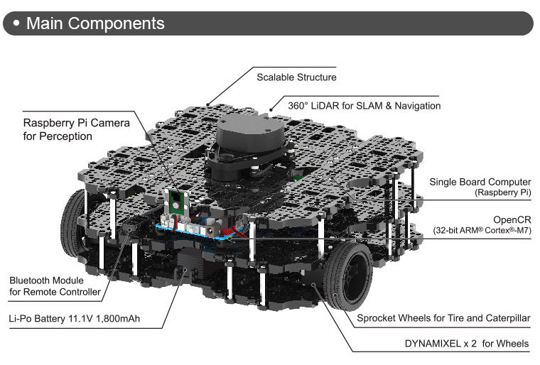

Lab 1: Moving the TurtleBot3
=============================================================================

In this course, we will use the `TurtleBot3 <https://emanual.robotis.com/docs/en/platform/turtlebot3/overview/>`_ platform.
TurtleBot3 is widely used in education, research, hobby, and product prototyping, and it is fully supported by ROS.

Getting Started
----------------------
In order to connect your VM to the TurtleBot3, you first need to find out the *name* of the robot you plan to use.
Currently, we have 3 TurtleBot3 robots in the lab. Their names are:

- pearl
- allen
- blum

Once you have chosen a robot, make sure that the battery is charged and connected.

.. note::
   See `battery guidelines <batteries.html>`_.

The battery should be placed in the bottom level of the robot, and the cables should be pushed inside:

Your robot is ready to go. You should power on the OpenCR using the front switch:

Connecting to the ROS network of the robot
--------------------------------------------------

Powering the OpenCR will also power the Raspberry Pi 3B+ in the robot. The
Raspberry Pi runs Ubuntu 18 with ROS Melodic. At boot, a ROS Master will be
started as well as several nodes in charge of the TurtleBot3 core functionality.
You should connect your VM to the ROS network of the robot in order to control
the robot as well as reading sensor data: basically, publishing and subscribing
to topics that are used by the nodes running on the TurtleBot3 Raspberry Pi.

To connect to the ROS network of the robot, you should connect to the WiFi network `cs4qatar`.

.. note::
   Check on Piazza the post "How to connect to cs4qatar".

Once you are connected to the network you need to take note of your IP address in the WiFi network.
It usually starts with `172.`. You can retrieve this IP using the command `ip a` in the terminal:

.. code-block:: bash

   ip a

.. warning::
   Make sure that your VM is configured in bridged mode and that you are bridging the WiFi interface.
   Contact the TA if you cannot see a valid IP address in the VM, and are unsure about how to set the network mode in the VM.

Finally, we need to set 3 environment variables in each terminal that we want to use to run ROS commands:

- ROS_MASTER_URI: This is required to tell your ROS nodes where they can locate the master (turtlebot).
- ROS_HOSTNAME: This sets the declared network address of the nodes that you will launch. You should use your IP address in the WiFi network.
- TURTLEBOT3_MODEL:

You can create a file `connect_robot.sh` in your home directory with the following content:

.. code-block:: bash

   export ROS_MASTER_URI="http://<name of your robot>.qatar.cmu.edu:11311"
   export ROS_HOSTNAME=<your ip address>
   export TURTLEBOT3_MODEL=waffle_pi

Then, everytime you open a new terminal window, type

.. code-block:: bash

   source ~/connect_robot.sh

This will set the variables for you.

.. note::

   You should set the environment variables in all the terminals. If your IP
   address changes, you will need to update the file and re-run the source
   command in each terminal window that you want to use.

Testing the communication with the ROS network
--------------------------------------------------

Open a new terminal window and set the environment variables:

.. code-block:: bash

   source ~/connect_robot.sh

Use the tool `rostopic` to see the list of topics currently used in the network:

.. code-block:: bash

   rostopic list

You should see a list of topics that looks similar to this

::

   /battery_state
   /cmd_vel
   /cmd_vel_rc100
   /diagnostics
   /firmware_version
   /imu
   /joint_states
   /magnetic_field
   /motor_power
   /odom
   /reset
   /rosout
   /rosout_agg
   /rpms
   /scan
   /sensor_state
   /sound
   /tf
   /version_info

Now you are ready to move the robot!

Teleoperate the robot using the keyboard
-----------------------------------------

To test that everything is fine, we can do a quick test using the `turtlebot3_teleop` package:

.. code-block:: bash

   roslaunch turtlebot3_teleop turtlebot3_teleop_key.launch

If the node is successfully launched, the following instruction will be appeared to the terminal window.

::

  Control Your Turtlebot3!
  ---------------------------
  Moving around:
          w
     a    s    d
          x

  w/x : increase/decrease linear velocity
  a/d : increase/decrease angular velocity
  space key, s : force stop

  CTRL-C to quit

Visualizing the trajectories in RViz
-----------------------------------------

While moving the robot, you can use **RViz** to visualize the robot trajectory. In a new terminal, set the environment variables and launch rviz with a predefined configuration for the turtlebot3. But first, we need to run `turtlebot3_remote.launch` to load the 3D model of the robot (otherwise, it won't show in RViz).

.. code-block:: bash

   source ~/connect_robot.sh
   roslaunch turtlebot3_bringup turtlebot3_remote.launch

Open a new terminal and run:

.. code-block:: bash

   source ~/connect_robot.sh
   rosrun rviz rviz -d `rospack find turtlebot3_description`/rviz/model.rviz

.. note::
   The previous command runs rviz using a predefined configuration. What's the purpose of `rospack find turtlebot3_description` here?

You should now have an RViz window open showing the TurtleBot3 (the real one!).

.. image:: img/tbot3_rviz.png
  :width: 600
  :alt: Alternative text

Change the `Fixed Frame` to `odom` in the `Global Options`.

Create a visualization for the `/odom` topic by clicking `Add` in the `Displays pane`

Tune the visualization parameters to make it nicer. We use:

- Shaft Length: 0.1
- Shaft Radius: 0.005
- Head Length: 0.05
- Head Radius: 0.02

Now you can move the robot and visualize its trajectory. You are ready to do the Lab!
