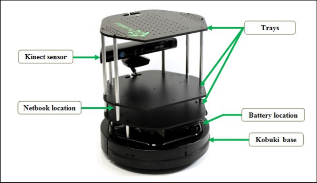

Lab 1: Moving the TurtleBot3
=============================================================================

In this course, we will also use the `TurtleBot2 <https://www.turtlebot.com/turtlebot2/>`_ platform.
TurtleBot2 is a low-cost, robor kit with open-source software widely used in education, research, hobby, and product prototyping, and it is fully supported by ROS.

Getting Started
----------------------
In order to connect your VM to the TurtleBot2, you first need to find out the *name* of the robot you plan to use.
Currently, we have 3 TurtleBot2 robots in the lab. Their names are:

- minsky
- knuth
- karp (not operational for the moment)

The names are associated to the laptop that runs the robot software. Once you
have chosen a laptop and a robot, make sure that the base is connected to the
laptop. Power on the base first and then boot the laptop by pressing the on/off
switch. Once it boots, you should see the ubuntu splash screen and see the linux booting.
After that, you should hear a sound that indicates the robot is ready to go.

The laptop lid should be closed and the laptop placed in the bottom level of the robot, and the cables should be pushed inside:

Your robot is ready to go.

Connecting to the ROS network of the robot
--------------------------------------------------

 At boot, a ROS Master will be started as well as several nodes in charge of the
TurtleBot2 core functionality. You should connect your VM to the ROS network of
the robot in order to control the robot as well as reading sensor data:
basically, publishing and subscribing to topics that are used by the nodes
running on the TurtleBot2 laptop.

To connect to the ROS network of the robot, you should connect to the WiFi network `cs4qatar`.

.. note::
   Check on Piazza the post "How to connect to cs4qatar".

Once you are connected to the network you need to take note of your IP address in the WiFi network.
It usually starts with `172.`. You can retrieve this IP using the command `ip a` in the terminal:

.. code-block:: bash

   ip a

.. warning::
   Make sure that your VM is configured in bridged mode and that you are bridging the WiFi interface.
   Contact the TA if you cannot see a valid IP address in the VM, and are unsure about how to set the network mode in the VM.

Finally, we need to set 3 environment variables in each terminal that we want to use to run ROS commands:

- ROS_MASTER_URI: This is required to tell your ROS nodes where they can locate the master (turtlebot).
- ROS_HOSTNAME: This sets the declared network address of the nodes that you will launch. You should use your IP address in the WiFi network.

You can create a file `connect_robot.sh` in your home directory with the following content:

.. code-block:: bash

   export ROS_MASTER_URI="http://<name of your robot>.qatar.cmu.edu:11311"
   export ROS_HOSTNAME=<your ip address>

Then, everytime you open a new terminal window, type

.. code-block:: bash

   source ~/connect_robot.sh

This will set the variables for you.

.. note::

   You should set the environment variables in all the terminals. If your IP
   address changes, you will need to update the file and re-run the source
   command in each terminal window that you want to use.

Testing the communication with the ROS network
--------------------------------------------------

Open a new terminal window and set the environment variables:

.. code-block:: bash

   source ~/connect_robot.sh

Use the tool `rostopic` to see the list of topics currently used in the network:

.. code-block:: bash

   rostopic list

You should see a list of topics that looks similar to this

::

   /battery_state
   /cmd_vel
   /cmd_vel_rc100
   /diagnostics
   /firmware_version
   /imu
   /joint_states
   /magnetic_field
   /motor_power
   /odom
   /reset
   /rosout
   /rosout_agg
   /rpms
   /scan
   /sensor_state
   /sound
   /tf
   /version_info

Now you are ready to move the robot!

Teleoperate the robot using the keyboard
-----------------------------------------

To test that everything is fine, we can do a quick test using the `turtlebot_teleop` package. But first, you need to install these packages:

.. code-block:: bash

   cd ~/catkin_ws/src; git clone https://github.com/turtlebot/turtlebot.git

After that, you should build the packages

.. code-block:: bash

   cd ~/catkin_ws/; catkin make

Finally, you can launch the turtlebot teleop key:

.. code-block:: bash

   roslaunch turtlebot_teleop keyboard_teleop.launch

If the node is successfully launched, the following instruction will be appeared to the terminal window.

::

  Control Your Turtlebot3!
  ---------------------------
  Moving around:
          w
     a    s    d
          x

  w/x : increase/decrease linear velocity
  a/d : increase/decrease angular velocity
  space key, s : force stop

  CTRL-C to quit

Visualizing the trajectories in RViz
-----------------------------------------

While moving the robot, you can use **RViz** to visualize the robot trajectory. In a new terminal, set the environment variables and launch rviz with a predefined configuration for the turtlebot3. But first, we need to run `turtlebot3_remote.launch` to load the 3D model of the robot (otherwise, it won't show in RViz).

.. code-block:: bash

   source ~/connect_robot.sh
   roslaunch turtlebot_rviz_launchers view_robot.launch

You should now have an RViz window open showing the TurtleBot2 (the real one!).

..
  .. image:: img/tbot2_rviz.png
  :width: 600
  :alt: Alternative text

Change the `Fixed Frame` to `odom` in the `Global Options`.

..
  .. image:: img/tbot_rviz_frameodom.png
  :width: 600
  :alt: Alternative text

Create a visualization for the `/odom` topic by clicking `Add` in the `Displays pane`

Tune the visualization parameters to make it nicer. We use:

- Shaft Length: 0.1
- Shaft Radius: 0.005
- Head Length: 0.05
- Head Radius: 0.02

..
  .. image:: img/tbot_rviz_showodom.png
  :width: 600
  :alt: Alternative text

Now you can move the robot and visualize its trajectory. You are ready to do the Lab!
