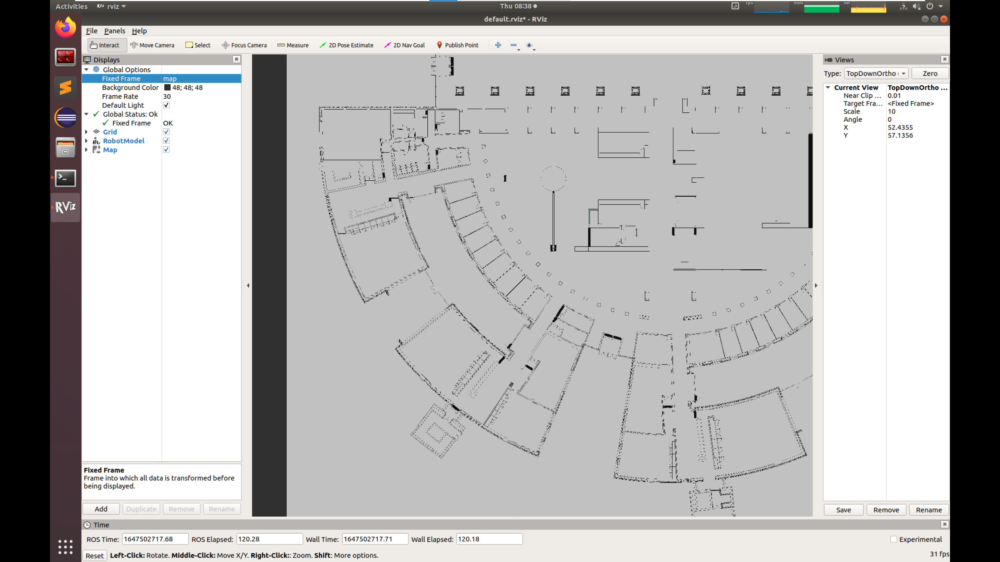
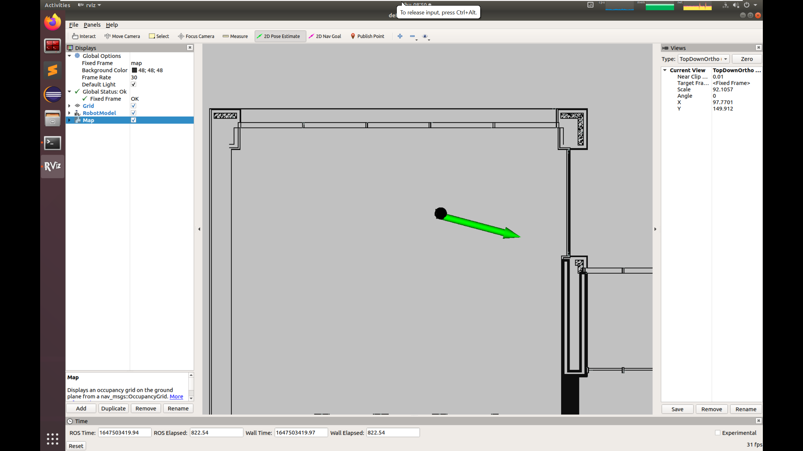
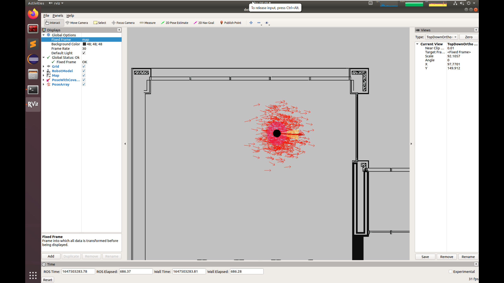
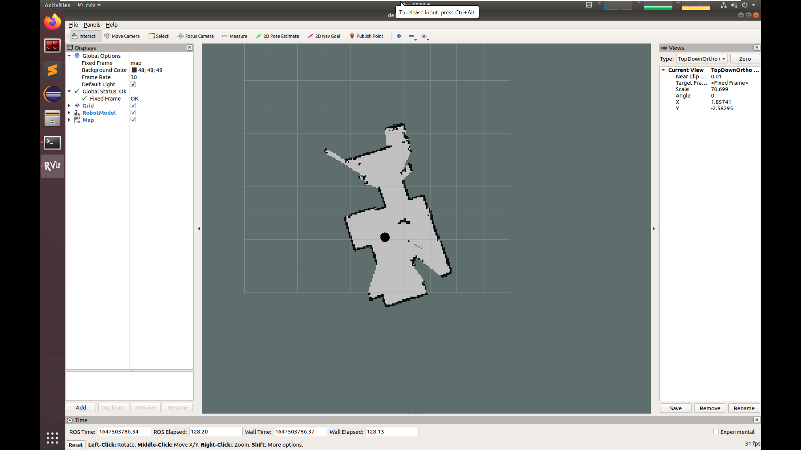

Lab 4: Localization using AMCL
=============================================================================

In this lab, we will use `amcl` package for localization. The amcl algorithm
implements Monte Carlo localization for state estimation. In the first part of
the lab, you will use amcl with a map that has already been built for you. In
the second part, you will build your own map using the `gmapping` package and
then use the resulting map for localization.

Getting Started
----------------------
Install the `gmapping` ros package in your VM.

.. code-block:: bash

   sudo apt install ros-melodic-gmapping

Clone the example code into your catkin workspace:

.. code-block:: bash

   cd ~/catkin_ws/src
   git clone https://github.com/cmuq-robotics/cmuq-turtlebot-remote.git

Launching the example
--------------------------------------------------

Connect to one of the robots and edit the file `connect_robot.sh` with the correct values.

Open a new terminal window and set the environment variables:

.. code-block:: bash

   source ~/connect_robot.sh

Use the tool `rostopic` to see the list of topics currently used in the network and check that you can connect to your robot.

.. code-block:: bash

   rostopic list

Launch the `teleop_key` node to move your robot:

.. code-block:: bash

   roslaunch turtlebot_teleop keyboard_teleop.launch

Part I: Using AMCL
-----------------------------------------

Open a new terminal window and set the environment variables:

.. code-block:: bash

   source ~/connect_robot.sh

Launch the `amcl_demo`

.. code-block:: bash

   roslaunch amcl_demo amcl_demo.launch

This launch file will start the amcl node with certain predefined parameters. It
also loads an existing map and publishes it in the `/map` topic. You can open
the file `~/catkin_ws/src/cmuq-turtlebot-remote/amcl_demo/amcl_demo.launch` to
see the configuration.

The `amcl` node uses the particle positions to compute and publish the transform
from `map` to `base_link`.

You can use **RViz** to visualize the progress of `amcl` as well as interact with the node.

In a new terminal, set the environment variables and run:

.. code-block:: bash

   source ~/connect_robot.sh
   rosrun rviz rviz

You should now have an RViz window.

You can add the robot model and the map and change the `Fixed Frame` to `map` in the `Global Options`.

When working with maps, it is useful to set the type of view to `TopDownOrtho` in the `Views` panel.

You should be able to see the map. However, the robot is not localized yet.

When amcl_demo loads the map of the environment, the TurtleBot does not know its
current location on the map. It needs a little help. Locate TurtleBot's position
in the map by looking at the rviz visualization and let TurtleBot know this
location by performing the following steps:

- Click on the 2D Pose Estimate button on the tool toolbar at the top of the main screen.
- Click the cursor on the location on the map where TurtleBot is located. A large green arrow will appear. Drag the mouse to extend the arrow in the direction TurtleBot is facing.

Make sure that the  `Fixed Frame` is set to `map` in the `Global Options`. Otherwise, it won't work.

Now you should see the robot appearing in the location that you chose.

You can also visualize pose covariance and the particles that amcl computes.
Click on the `Add` button on the `Displays` pane and add the topics `/amcl_pose/PoseWithCovariance` and `/particlecloud`.

Move your robot around and observe the performance of AMCL.

Part II: Using GMapping
-----------------------------------------

For the second part, you will need to kill all the nodes that you launched in
part I. Now we will use `gmapping` to build our own map. Gmapping implements a
laser-based SLAM algorithm. We will study SLAM in the next weeks. For now, let's learn how to use it.

Open a new terminal window and set the environment variables:

.. code-block:: bash

   source ~/connect_robot.sh

Launch the `gmapping_demo`

.. code-block:: bash

   roslaunch gmapping_demo gmapping.launch

In a new terminal, set the environment variables and run:

.. code-block:: bash

   source ~/connect_robot.sh
   rosrun rviz rviz

You should now have an RViz window.

You can add the robot model and the map (topic `/map`) and change the `Fixed Frame` to `map` in the `Global Options`.

While moving your robot, you will observe how the map is being built.

When you are done, you can save the map. In a new terminal, set the environment variables and run:

.. code-block:: bash

   source ~/connect_robot.sh
   rosrun map_server map_saver -f ~/catkin_ws/src/cmuq-turtlebot-remote/my_map

You now have a copy of the map in your catkin workspace.

Now it's time to stop gmapping.

Finally, you should repeat part I but now using our map. Edit the launch file
`amcl_demo.launch` in the `amcl_demo` package to make it work with the map you
just saved.
